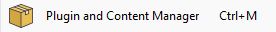
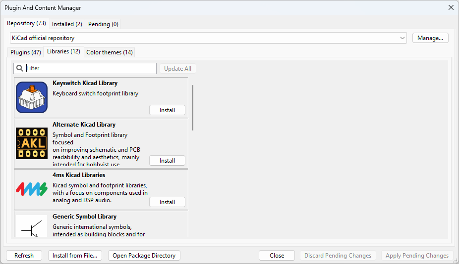
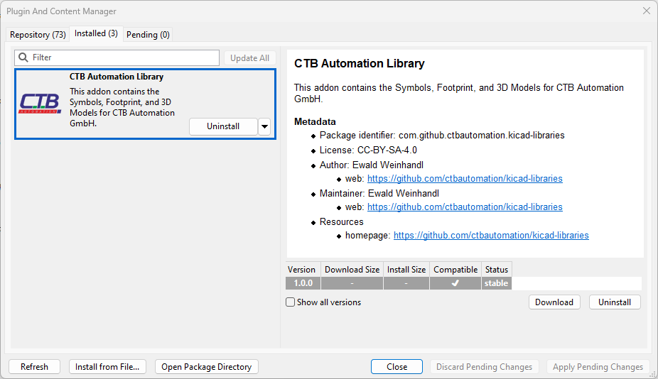

# CTB Automation KiCad Library

> Notice: A major update from version 1.0.0 was made to be compliant to the [KLC](https://klc.kicad.org/). Please consider updating your library and checking the symbols and footprints.

> From the version 1.0.0, the library instalation process is done by the PCM.

This repository contains the Symbols, Footprint, and 3D Models for the Espressif SoC and Modules family.

* Notice: The libraries are provided in the hope that they will be useful but without a warranty of any kind.

**The libraries in this repository are intended to be used with KiCad version 8.**

Each footprint library is stored as a directory with the .pretty suffix. The footprint files are .kicad_mod files within.

## Symbols and Footprints

All footprints were designed according to the Recommended PCB Land Pattern section present on each module datasheet.

## Manual Installation - PCM

The Espressif KiCad library is distributed via the Pluguin and Content Manager (PCM) and the installation is done automatically.

To install the library, you need to download the **[ctb-kicad-addon.zip](https://github.com/ctbautomation/kicad-libraries/releases/latest/download/ctb-kicad-addon.zip)** file from the latest release. For legacy support, please visit the legacy branch and follow the instructions from there.

## [Download here the latest library!](https://github.com/ctbautomation/kicad-libraries/releases/latest/download/ctbautomation-kicad-addon.zip)

> Make sure to download the correct zip file and ***do not extract the files***. If you are using macOS and Safari, ensure to that the automatic unzip feature (**Open safe files after downloading**) is disabled.

* [Latest Release Notes and Files](https://github.com/ctbautomation/kicad-libraries/releases/latest)

For KiCad 8 you can use the following steps:

1. On KiCad, open the PCM in the main KiCad window.

2. The PCM window will display a list of available plugins, libraries, and color themes. You can browse through the categories or use the search bar to find a specific package.

3. To install the library manually using the ZIP file from the latest release, you need to select the file from **"Install from file..."**

4. Once the package is installed, you will see the Espressif Library listed on the Installed tab.

5. Now you are ready to use the library. Note that the library will be listed as **PCM_Espressif** in the Symbol and Footprint.

## Contributing

If you want to contribute, please consider sending us a Pull Request (PR).

### About KiCad

KiCad is a Cross-Platform and Open Source Electronics Design Automation Suite. See [KiCad EDA](https://kicad.org/) for more information.
